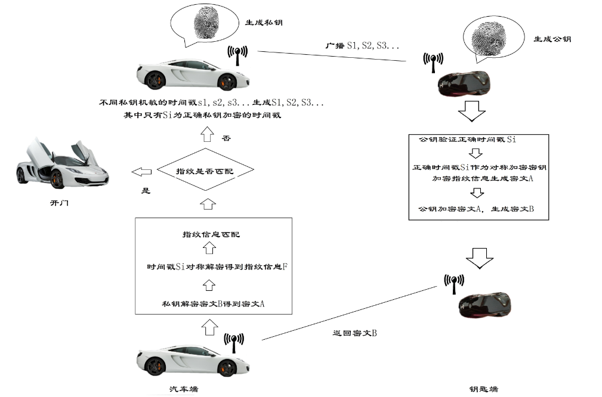
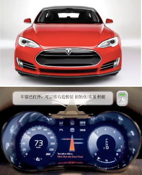
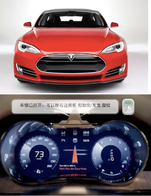
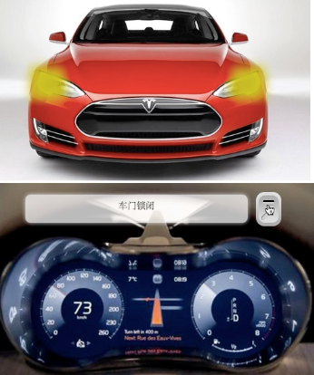

#智能指纹识别汽车遥控器系统
Intelligent Car Remote System Based on Fingerprint Recognition

@(韩力超)[智能车|帮助|Link]

-------------------

[TOC]

##概述
###  产品特点
>*   指纹唯一性确保安全
*   通信传输协议安全
*	数据处理、加密方式保证安全性
*	传统的“钥匙”更迭为数据处理工具时，“钥匙”更换成本低廉
*	丢失钥匙烦恼几乎降低为0
*	系统安全性几乎达到100%
*   指纹唯一性确保安全
*	通信传输协议安全
*	数据处理、加密方式保证安全性
*	传统的“钥匙”更迭为数据处理工具时，“钥匙”更换成本低廉
*	丢失钥匙烦恼几乎降低为0
*	系统安全性几乎达到100%

###  应用前景
>成本较低，有着极高的性价比，这使得产品可以推广到一些相对来说价值稍低，但同样有着较高安全需求的物品保管领域中。因为人的指纹具有唯一性，具有指纹识别记录的系统可以在交通事故调查方面提供线索和证据，提高了警方的办案效率，为其提供了一种新的调查途径等。


## 作品设计与实现
### 三个基本假设
>以下三个基本假设是本方案提出的基本理论依据。
*   无线通信链路是不可靠的
*	非易失性存储器是不可靠的
*	指纹和RSA鉴权方式是可靠的

### 系统总体架构
 >本系统中，使用嵌入式Linux机作为上位机，R1020作下位机，处理速度快，功能强大。同时使用基带通信的方式，大大减少了通信的成本，并提高了效率。

### 系统分架构
#### 基于R1020的指纹识别系统
>*   上传指纹特征数据到主机,下载指纹特征数据到模块(入库/验证/识别)；
>*	上传指纹图像到主机,下载指纹图像到模块(提取指纹特征入库/与活体指纹验证/识别)；
>*	检查指定编号范围内的已注册保存在模块闪存内的指纹模板数据是否有坏损情况；
>*	设置/读取指纹模块的序列号。

#### 基于嵌入式Linux系统的开发
>实时性能RT_Linux Hardhat Linux 等嵌入式Linux支持，实时性能稳定性好安全性好。
#### 采用基带传输方式进行通信
>基带传输，是一种不搬移基带信号频谱的传输方式。

### 总体流程


>*  初始化车载端指纹模块，初始化操作需要按两次指纹，如果两次指纹匹配成功，则初始化成功，否则需要重新做初始化。
>*  初始化成功后，利用指纹特征提取算法提取指纹特征值。
>* 通过改良RSA非对称加密算法，利用指纹特征值生成RSA私钥。
>* 车载端广播不同私钥签名的伪时间戳，其中只有一个时间是利用正确私钥加密的间戳。
>* 钥匙端初始化，然后录取指纹。
>* 钥匙端利用指纹特征提取算法提取指纹特征值。
>* 通过改良RSA非对称加密算法，利用指纹特征值生成RSA公钥。
>* 钥匙端接收时间戳，公钥验证出正确时间戳，同步本地时间。
>* 用正确时间戳对称加密指纹信息生成密文A。
>* 公钥非对称加密密文A生成密文B。
>* 	密文B在基带通信模式下被反馈给车载端。
>* 车载端私钥解密密文B生成密文A。
>* 车载端利用当时本地时间来作为私钥来对密文A对称解密得到指纹信息F。
>* 指纹信息F与车载本地指纹进行匹配，匹配成功则打开车门，匹配不成功则返回(c)。

### 具体实现方案
#### 面向无连接基带传输协议传输数据
>本系统的基带传输协议中允许随时广播消息，为后续伪数据防盗提供平台。本方案利用了非对称加密当中私钥签名的特点，这样，整个基带传输协议是完全可以公开的。在系统模拟的过程中采用同是无连接传输数据的UDP来模拟面向无连接的基带传输数据的方式。   
####  即生即用的非记忆性存储
>在指纹传输中，我们应用即生即用的指纹特征作为秘钥，来加密用户的指纹信息，做到了在钥匙端不存储任何信息的特点。
#####  发送伪数据防盗取机制
>本系统设计了基于系统时间的令牌机制，系统会不时向外广播一串一串的私钥加密的时间戳，不同的时间戳用不同的token进行标记，其中只有一个时间戳为正确时间戳，也只有保证这个时间戳的准确才能完成后续的对称加解密。
####   数据的实效性
>车载端一直在向外广播数据签名过的时间戳信息，时效性为1s，1s之内没有返回数据消息就自动失效。程序执行时间、数据传输时间总共不会超过500ms，防止黑客利用重放技术来攻击系统。
####	改良的RSA非对称加密算法
>根据系统的设计要求，本系统与传统RSA应用系统的一个重大区别在于，改良RSA系统即生即用，不保存自己的密钥和对方的公钥。
#### “黑匣子”功能
>我们建立的用户管理系统，拥有用户记录的功能，可以作为行车记录的“黑匣子”，由于通过指纹唯一确定个人的身份，一旦涉案等特殊情况发生，可以提供追查途径。
## 作品测试与分析
###	测试环境搭建
> 本测试系统中，使用嵌入式Linux机作为上位机，基于FPC1020面阵式半导体电容指纹传感器开发的指纹识别模块R1020作下位机，结合PC机模拟汽车系统，完成系统测试。
###	 测试过程
 如图是汽车的外观、汽车的仪表盘和我们的指纹遥控器。

汽车外观及仪表盘


指纹遥控器

> 车锁打开时，汽车车灯会闪烁两次。车锁锁闭时，汽车车灯会闪烁一次。仪表盘上面的提示框会显示当前汽车的状态或需要用户进行的操作。我们可以看到，现在汽车处于开放状态，当前汽车没有匹配的指纹，需要进行初始化。


需要进行初始化


初始化成功
>演示使用指纹操作指纹遥控器来锁闭车门。按下指纹，车门锁闭。车灯闪烁一次，提示框提示车门锁闭。


锁闭车门
>再次按下指纹，车门打开，车灯闪烁两次，提示框提示车锁打开且可以重置指纹。仅有当车门打开时指纹才能被重置，重置指纹的操作步骤与初始化相同。重复几次这样的操作。发现系统运行正常。
###	 安全性测试过程
>使用错误的指纹操作指纹遥控器，可以看到车门无法打开或锁闭。


车门未打开

###	 测试结果
>测试结果符合预期要求，完美实现了指纹智能指纹识别汽车遥控器系统。安全性测试结果良好，安全有保证。 
## 创新性说明
### 现有实现方式
>*	现有的数据传输链路
>*	可记忆存储

### 本系统实现方式
>* 面向无连接基带传输协议传输数据
>* 即生即用的非记忆性存储
>* 发送伪数据防盗取机制
>* 数据的实效性保证安全
>* 改良的RSA非对称加密算法
>* 脚本语言开发
>* “黑匣子”功能

### 代码块
``` python

... 访问链接
```

## 反馈与建议
- Sina微博：[@hanlichao1993](http://weibo.com/3038600720/profile?topnav=1&wvr=6)
- 邮箱：<hanlicao@bupt.edu.cn>

---------
感谢阅读


