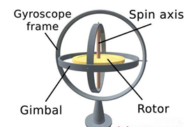
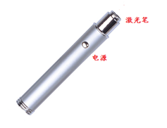
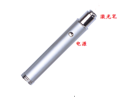
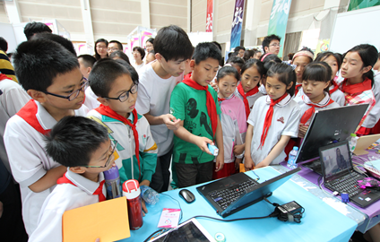
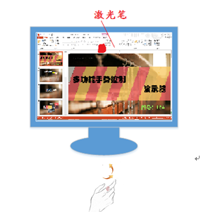
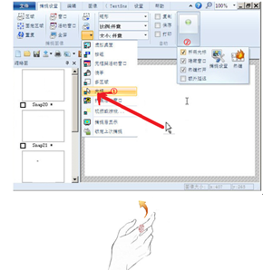

#多功能手势演示系统 
A multimedia presentation system based on gesture recognition

@(韩力超)[手势|帮助|Link]

-------------------

[TOC]

##概述
###  灵感来源
>本创新设计的灵感来源老师在课堂教学时，常常使用PPT翻页器，但是我们发现，老师上课操作非常不方便，例如在按键时常会发生按错位置或找不到按键而需要认真确认，然后灵敏度也不是很准确，必须在一定的范围内操作，不能长距离离开翻页器接收装置，要是应用PPT指针选项的画笔就必须使用鼠标，操作非常不方便。

###  创作意图
现在市场上大量出现的产品如下图所示。可以通过按键来实现基本功能。


市场上激光笔
>第一次使用还得认真确认按键的位置，按起来也觉得不舒服。还有重要一点，因为需要按很多键实现功能，所以产品不可能做的很小。

###主要用途
>主要可以用于教学系统，同时可以适用于演讲者，需要手势控制PPT演示或者手势控制桌面操作系统的场合。再向更大方面拓展，可以用于各种多媒体演示系统。
###经济价值及应用前景
>经济价值上，本团队做成的实验模型除去人力成本价格基本控制在60~70元，若是大规模批量生产，价格可以降低至40元以下，价格对于消费人群来说会非常合理，并且愿意被消费者接受。

## 系统原理
### 硬件原理
> 单片机硬件部分，改进了原有单片机使其准确性和灵敏度得到提高。另外在其中增加了自动休眠和唤醒功能，同时可以自动进入休眠状态，功耗降低，提高其待机时长。

#### 九轴陀螺仪



>*	 连单片机
>*	 用上位机监视模块与单片机的通信

####Arduino Nano单片机

#### HC-05蓝牙模块

#### 手势捕捉端

### 软件原理
####Windows端
>Win32系统把文件的概念进行了扩展。无论是文件、通信设备、命名管道、邮件槽、磁盘、还是控制台，都是用API函数CreateFile来打开或创建的。因此，只需通过CreateFile函数打开指定的串口即可获取串口的I/O流。

``` python
 BOOL CSampleDlg:: PortOpen() 
{    
  BOOL m_Opened;
 m_Serial.SetCommPort(2);  
 m_Serial.SetSettings("4800,N,8,1");      
 m_Serial.SetInBufferSize(1024);
 m_Serial.SetInBufferCount(0);
 m_Serial.InputMode(1); 
 m_Serial.SetInputLen(0);                         
 m_Opened=m_Serail.SetPortOpen(1);
 return     m_Opened;            
}       
```   

####Arduino Nano单片机端
>多功能演示器在一定时间内没有对其进行操控时，则自动进入休眠状态，功耗降低，提高其待机时长。当在自动休眠状态下接收到活动指令时，则会自动退出休眠状态，开始进入工作状态.

``` python
void loop() 
{    if(SleepOrNot==0)
    { decodedata();
      SleepTiming2 = millis(); }
    if(w[1]>1000&&SleepOrNot==0&&RightClick==1)
    {  RightClick=0;
      Bluetooth.print("rightoff\n");
      w[1] = 0;
      delay(500);    }
      if(SleepOrNot==0 && SleepTiming2-SleepTiming1 > 60000 
         && RightClick == 0)//无按键按下时长判断
      {   leepOrNot = 1;
	       digitalWrite(2, LOW);   //MPU6050 Off
          digitalWrite(13,LOW);
	       PowerOn = 0;        
          energy.PowerDown();  //go into Powerdown mode      }
  if(a[2]>0.40&&StartOrNot==0&&digitalRead(3)==LOW
      &&SleepOrNot==0&&RightClick==0)//开始
  {   delay(20);
      if(digitalRead(3)==LOW)
      {  Bluetooth.write("start\n");
        a[2]=-1;
        StartOrNot=1;
        delay(500); } }
```

##系统实现
### 整体实现思路
>该项目主要是要研究如何通过远程手势捕捉装置上搭载的陀螺仪、加速度感应器等传感器来捕捉、识别操作者的手势动作，将捕捉到的数据通过蓝牙无线传输给PC，在PC端蓝牙接收，驱动程序通过串口读取蓝牙接收到的数据


###细节实现流程图

单片机控制端实现流程图 

单片机中断程序流程图

PC控制端流程图

##产品特色
多功能手势演示装置只有一个按键——电源键。可以实现以下强大功能：

多功能手势演示

>而且产品可升级，重要的是操作成功率接近100%。

##产品升级

 现阶段产品


 升级版多功能“迷你”手势控制演示器
##功能展示
###实物图片演示

参与第七届大学生创新展
###部分功能展现-手势控制PPT
手势控制PPT全屏

手势控制PPT左翻页

手势控制PPT右翻页

手势控制激光笔

空中鼠标



##代码实现
``` python
参考网页地址
```


---------------
## 反馈与建议
- Sina微博：[@hanlichao1993](http://weibo.com/3038600720/profile?topnav=1&wvr=6)
- 邮箱：<hanlicao@bupt.edu.cn>

---------
感谢阅读


